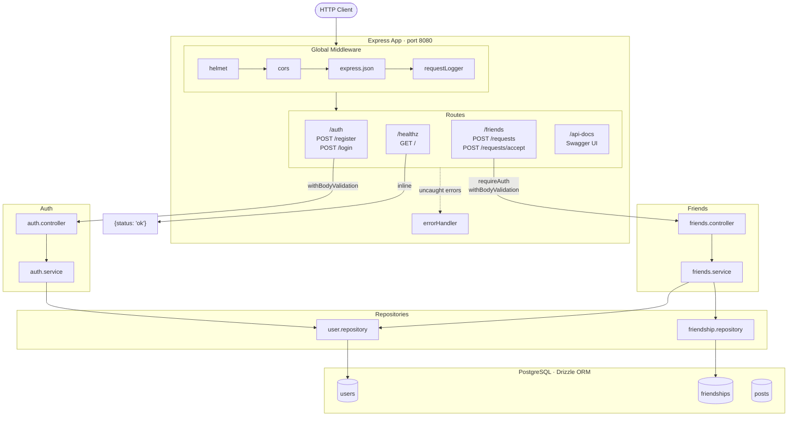

# Architecture

Minimal Express 5 API in TypeScript. Requests flow through a global middleware chain, then to feature routers, each with their own validation and optional auth middleware. Business logic lives in service modules; data access is isolated in repositories backed by Drizzle ORM over PostgreSQL.

